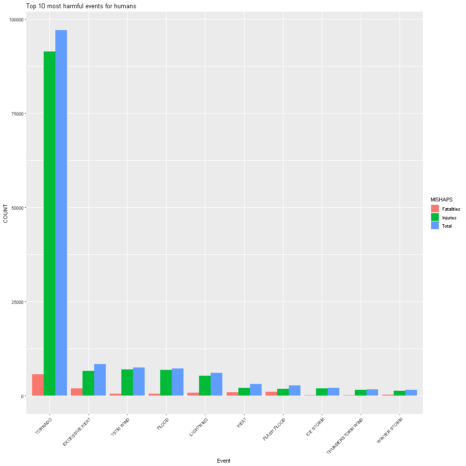
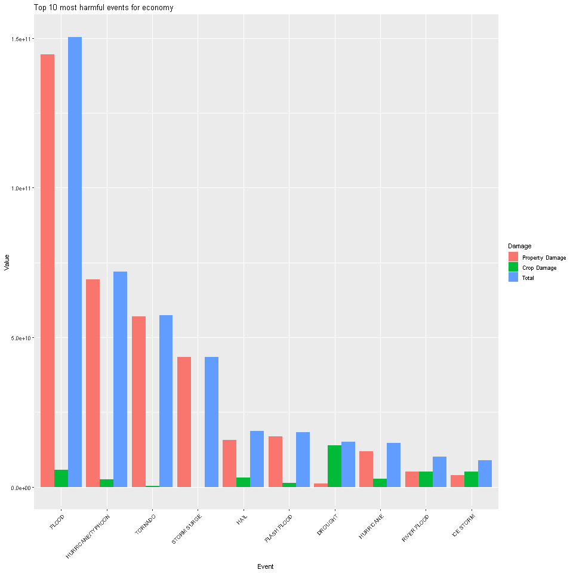

# Analyzing which weather events are the most dangerous with respect to the human life and the economy


## Synopsis


### The study conducted by the United States National Oceanic and Atmospheric Administration analyzes data collected from 1950 to 2011 about the damages caused to property, crops and human life (both fatalities and injuries)


## Data Processing


### We first load the necessary libraries needed for the analysis


```r
library(dplyr)
library(tidyr)
library(reshape2)
library(ggplot2)
library(knitr)
```


### We then download the raw data file


```r
if(!file.exists("Storm data.csv.bz2")){
  url <- "https://d396qusza40orc.cloudfront.net/repdata%2Fdata%2FStormData.csv.bz2"
  download.file(url, "Storm data.csv.bz2", method = "curl", mode = "wd")
}
```


### The zip file is unzipped extrenally using the WinRAR application and then read into the object "a"


```r
a = read.csv("repdata_data_StormData.csv")
str(a)
```

```
## 'data.frame':	902297 obs. of  37 variables:
##  $ STATE__   : num  1 1 1 1 1 1 1 1 1 1 ...
##  $ BGN_DATE  : chr  "4/18/1950 0:00:00" "4/18/1950 0:00:00" "2/20/1951 0:00:00" "6/8/1951 0:00:00" ...
##  $ BGN_TIME  : chr  "0130" "0145" "1600" "0900" ...
##  $ TIME_ZONE : chr  "CST" "CST" "CST" "CST" ...
##  $ COUNTY    : num  97 3 57 89 43 77 9 123 125 57 ...
##  $ COUNTYNAME: chr  "MOBILE" "BALDWIN" "FAYETTE" "MADISON" ...
##  $ STATE     : chr  "AL" "AL" "AL" "AL" ...
##  $ EVTYPE    : chr  "TORNADO" "TORNADO" "TORNADO" "TORNADO" ...
##  $ BGN_RANGE : num  0 0 0 0 0 0 0 0 0 0 ...
##  $ BGN_AZI   : chr  "" "" "" "" ...
##  $ BGN_LOCATI: chr  "" "" "" "" ...
##  $ END_DATE  : chr  "" "" "" "" ...
##  $ END_TIME  : chr  "" "" "" "" ...
##  $ COUNTY_END: num  0 0 0 0 0 0 0 0 0 0 ...
##  $ COUNTYENDN: logi  NA NA NA NA NA NA ...
##  $ END_RANGE : num  0 0 0 0 0 0 0 0 0 0 ...
##  $ END_AZI   : chr  "" "" "" "" ...
##  $ END_LOCATI: chr  "" "" "" "" ...
##  $ LENGTH    : num  14 2 0.1 0 0 1.5 1.5 0 3.3 2.3 ...
##  $ WIDTH     : num  100 150 123 100 150 177 33 33 100 100 ...
##  $ F         : int  3 2 2 2 2 2 2 1 3 3 ...
##  $ MAG       : num  0 0 0 0 0 0 0 0 0 0 ...
##  $ FATALITIES: num  0 0 0 0 0 0 0 0 1 0 ...
##  $ INJURIES  : num  15 0 2 2 2 6 1 0 14 0 ...
##  $ PROPDMG   : num  25 2.5 25 2.5 2.5 2.5 2.5 2.5 25 25 ...
##  $ PROPDMGEXP: chr  "K" "K" "K" "K" ...
##  $ CROPDMG   : num  0 0 0 0 0 0 0 0 0 0 ...
##  $ CROPDMGEXP: chr  "" "" "" "" ...
##  $ WFO       : chr  "" "" "" "" ...
##  $ STATEOFFIC: chr  "" "" "" "" ...
##  $ ZONENAMES : chr  "" "" "" "" ...
##  $ LATITUDE  : num  3040 3042 3340 3458 3412 ...
##  $ LONGITUDE : num  8812 8755 8742 8626 8642 ...
##  $ LATITUDE_E: num  3051 0 0 0 0 ...
##  $ LONGITUDE_: num  8806 0 0 0 0 ...
##  $ REMARKS   : chr  "" "" "" "" ...
##  $ REFNUM    : num  1 2 3 4 5 6 7 8 9 10 ...
```


### using str(a), we can see that there are a lot of unncecessary variables within the object. So we then proceed to keep only the required data. We first convert the dataframe "a" into a tibble dataframe "c" so that the "dplyr" functions "select" and "filter" are carried out more easily


```r
c = as_tibble(a)
c = c %>% select(EVTYPE, FATALITIES, INJURIES, PROPDMG, PROPDMGEXP, CROPDMG, CROPDMGEXP)
c = c %>% filter(FATALITIES > 0 | INJURIES > 0 | PROPDMG > 0 | CROPDMG > 0)
```


```r
table(c$PROPDMGEXP)
```

```
## 
##             -      +      0      2      3      4      5      6      7      B      h      H      K      m      M 
##  11585      1      5    210      1      1      4     18      3      3     40      1      6 231428      7  11320
```

```r
table(c$CROPDMGEXP)
```

```
## 
##             ?      0      B      k      K      m      M 
## 152664      6     17      7     21  99932      1   1985
```


### The table functions shows that there are letters and words and symbols used to denote the exponent of the values. We need to convert these into a common structured data. if else loops are used for this purpose


```r
seq = 1 : nrow(c)

for (i in seq){
  if (c$PROPDMGEXP[i] == "" | c$PROPDMGEXP[i] == "-" | c$PROPDMGEXP[i] == "+" | c$PROPDMGEXP[i] == "0"){
    c$PROPDMGEXP[i] = 10^0
  }
  else if (c$PROPDMGEXP[i] == "1"){
    c$PROPDMGEXP[i] = 10^1
  }
  else if (c$PROPDMGEXP[i] == "2" | c$PROPDMGEXP[i] == "h" | c$PROPDMGEXP[i] == "H") {
    c$PROPDMGEXP[i] = 10^2
  }
  else if (c$PROPDMGEXP[i] == "3" | c$PROPDMGEXP[i] == "K" | c$PROPDMGEXP[i] == "k"){
    c$PROPDMGEXP[i] = 10^3
  }
  else if (c$PROPDMGEXP[i] == "4"){
    c$PROPDMGEXP[i] = 10^4
  }
  else if (c$PROPDMGEXP[i] == "5"){
    c$PROPDMGEXP[i] = 10^5
  }
  else if (c$PROPDMGEXP[i] == "6" | c$PROPDMGEXP[i] == "m" | c$PROPDMGEXP[i] == "M"){
    c$PROPDMGEXP[i] = 10^6
  }
  else if (c$PROPDMGEXP[i] == "7"){
    c$PROPDMGEXP[i] = 10^7
  }
  else if (c$PROPDMGEXP[i] == "8"){
    c$PROPDMGEXP[i] = 10^8
  }
  else if (c$PROPDMGEXP[i] == "9" | c$PROPDMGEXP[i] == "B"){
    c$PROPDMGEXP[i] = 10^9
  }
}

table(c$PROPDMGEXP)
```

```
## 
##      1    100   1000  10000  1e+05  1e+06  1e+07  1e+09 
##  11801      8 231429      4     18  11330      3     40
```


### we can see that the exponents have been converted into proper structured data


```r
for (i in seq){
  if (c$CROPDMGEXP[i] == "" | c$CROPDMGEXP[i] == "?" | c$CROPDMGEXP[i] == "0"){
    c$CROPDMGEXP[i] = 10^0
  }
  else if (c$CROPDMGEXP[i] == "K" | c$CROPDMGEXP[i] == "k"){
    c$CROPDMGEXP[i] = 10^3
  }
  else if (c$CROPDMGEXP[i] == "m" | c$CROPDMGEXP[i] == "M"){
    c$CROPDMGEXP[i] = 10^6
  }
  else if (c$CROPDMGEXP[i] == "B"){
    c$CROPDMGEXP[i] = 10^9
  }
}

table(c$CROPDMGEXP)
```

```
## 
##      1   1000  1e+06  1e+09 
## 152687  99953   1986      7
```


### the exponents have been converted into proper structured data


```r
str(c)
```

```
## tibble [254,633 x 7] (S3: tbl_df/tbl/data.frame)
##  $ EVTYPE    : chr [1:254633] "TORNADO" "TORNADO" "TORNADO" "TORNADO" ...
##  $ FATALITIES: num [1:254633] 0 0 0 0 0 0 0 0 1 0 ...
##  $ INJURIES  : num [1:254633] 15 0 2 2 2 6 1 0 14 0 ...
##  $ PROPDMG   : num [1:254633] 25 2.5 25 2.5 2.5 2.5 2.5 2.5 25 25 ...
##  $ PROPDMGEXP: chr [1:254633] "1000" "1000" "1000" "1000" ...
##  $ CROPDMG   : num [1:254633] 0 0 0 0 0 0 0 0 0 0 ...
##  $ CROPDMGEXP: chr [1:254633] "1" "1" "1" "1" ...
```


### as we can see the exponents are of type character, hence we used "" in the for loops, now we convert them into numeric data


```r
c$PROPDMGEXP = as.numeric(c$PROPDMGEXP)
c$CROPDMGEXP = as.numeric(c$CROPDMGEXP)
str(c)
```

```
## tibble [254,633 x 7] (S3: tbl_df/tbl/data.frame)
##  $ EVTYPE    : chr [1:254633] "TORNADO" "TORNADO" "TORNADO" "TORNADO" ...
##  $ FATALITIES: num [1:254633] 0 0 0 0 0 0 0 0 1 0 ...
##  $ INJURIES  : num [1:254633] 15 0 2 2 2 6 1 0 14 0 ...
##  $ PROPDMG   : num [1:254633] 25 2.5 25 2.5 2.5 2.5 2.5 2.5 25 25 ...
##  $ PROPDMGEXP: num [1:254633] 1000 1000 1000 1000 1000 1000 1000 1000 1000 1000 ...
##  $ CROPDMG   : num [1:254633] 0 0 0 0 0 0 0 0 0 0 ...
##  $ CROPDMGEXP: num [1:254633] 1 1 1 1 1 1 1 1 1 1 ...
```


### now the exponents are in numeric form and can be used for multiplication. We save this in a new object "d"


```r
d = c
```


### we then do the multiplication in order to get the actual damage numbers


```r
d$PROPDMG = d$PROPDMG * d$PROPDMGEXP
d$CROPDMG = d$CROPDMG * d$CROPDMGEXP
```


### we then run aggregates to calculate total values caused by each weather event segregated by respective variables (property and crop) and (fatalities and injuries)


```r
popuDMG.byEVENT = aggregate(d[, c(2, 3)], by = list(EVENT = d$EVTYPE), FUN = sum)

econDMG.byEVENT = aggregate(d[, c(4, 6)], by = list(EVENT = d$EVTYPE), FUN = sum)
```


### we then create a another variable "total" in each of the two objects that calculates the total damaages by each event


```r
popuDMG.byEVENT$TOTAL = popuDMG.byEVENT$FATALITIES + popuDMG.byEVENT$INJURIES

econDMG.byEVENT$TOTAL = econDMG.byEVENT$PROPDMG + econDMG.byEVENT$CROPDMG
```


### we then sort the objects in desceneding order of total and extract the top 10 from each object


```r
popuDMG.byEVENT = popuDMG.byEVENT[order(popuDMG.byEVENT$TOTAL, decreasing = TRUE), ]
econDMG.byEVENT = econDMG.byEVENT[order(econDMG.byEVENT$TOTAL, decreasing = TRUE), ]

TOP.popuDMG.byEVENT = head(popuDMG.byEVENT, 10)
TOP.econDMG.byEVENT = head(econDMG.byEVENT, 10)
```


### we now have 4 variables in each object, in oder to visualize this data in a 2-D plot we melt these objects keeping "event" as the identifier


```r
TOP.econDMG.byEVENT = melt(data = TOP.econDMG.byEVENT, id.vars = "EVENT", variable.name = "DAMAGE", value.name = "VALUE")
TOP.popuDMG.byEVENT = melt(data = TOP.popuDMG.byEVENT, id.vars = "EVENT", variable.name = "MISHAPS", value.name = "COUNT")
```


### Now we plot our data


```r
png( filename = "top 10 for humans.png", width = 960, height = 960)
g = ggplot(data = TOP.popuDMG.byEVENT, aes(x = reorder(EVENT, -COUNT), y = COUNT))
g + geom_bar(stat = "identity", aes(fill = MISHAPS ), position = "dodge") +
  labs(title = "Top 10 most harmful events for humans", x = "Event", y = "COUNT") +
  theme(axis.text.x = element_text(angle = 45, vjust = 1, hjust = 1)) +
  scale_fill_discrete(name = "MISHAPS", labels = c("Fatalities", "Injuries", "Total"))
dev.off()
```

```
## png 
##   2
```

```r

```


```r
png( filename = "top 10 for economy.png", width = 960, height = 960)
h = ggplot(TOP.econDMG.byEVENT, aes(x = reorder(EVENT, -VALUE), y = VALUE))
h + geom_bar(stat = "identity", aes(fill = DAMAGE), position = "dodge") +
  labs(title = "Top 10 most harmful events for economy", x = "Event", y = "Value") +
  theme(axis.text.x = element_text(angle = 45, vjust = 1, hjust = 1)) +
  scale_fill_discrete(name = "Damage", labels = c("Property Damage", "Crop Damage", "Total"))
dev.off()
```

```
## png 
##   2
```

```r

```


##Based on these plots we can say that over time the most harmful weather events for the humans was Tornado while the most harmful event for the economy was the Flood


